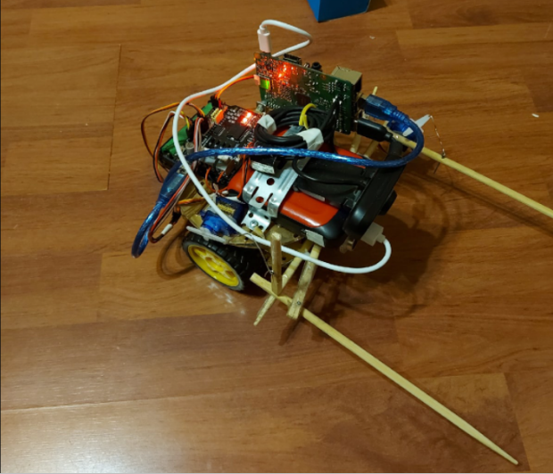

# Manipulator

## Задача
Подъехать к объекту и схватить его

## Реализация
Манипулятор состоит из подвижной тележки, звукового дальномера, бинсом, 
системой компьютерного зрения и устройством захвата(палочки для суши).

Объект для захвата представляет из себя синий куб.

Система компьютерного зрения анализирует входной поток, ищет синий куб и отправляет управляющие сигналы тележке.
До нахождения объекта захвата тележка вращается с заданной угловой скоростью с помощью ПИД-регулятора.
После обнаружения объекта движется в его сторону и, когда расстояние становится равным расстоянию захвата, 
тележка останавливается и схватывает объект.

Скрипты нуждаются в доработке и прочих вещах.
Конструкция манипулятора также нуждается в доработке.